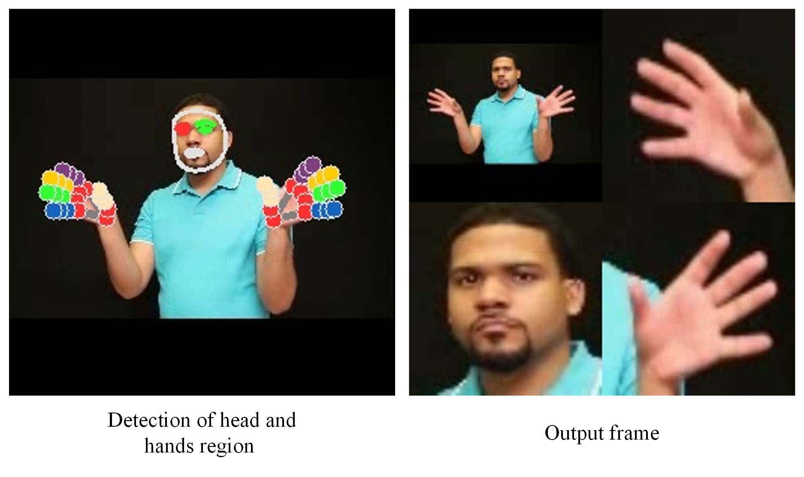
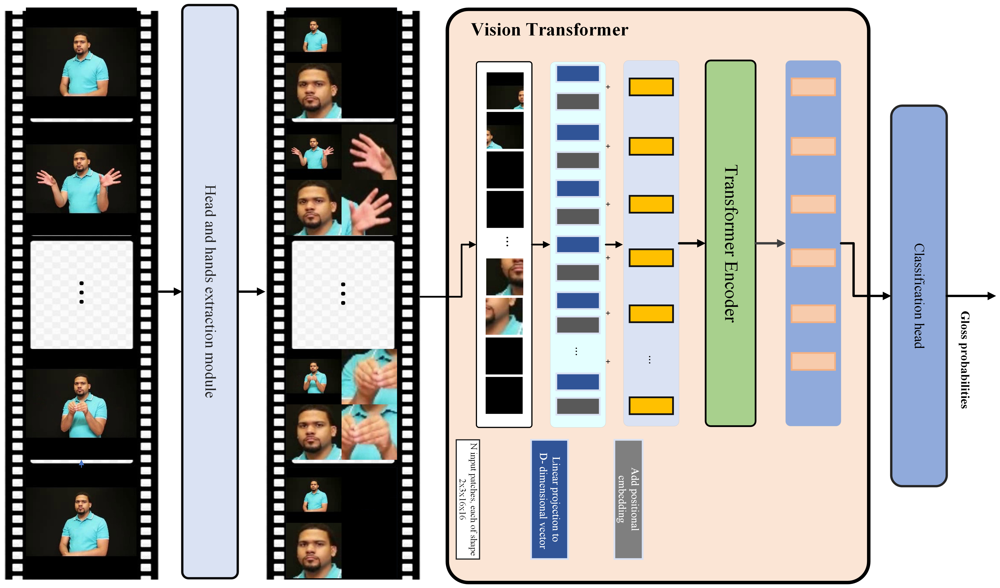

# SignNet: Vision Transformer-Based Isolated Sign Language Recognition with A Novel Head & Hands Tunnelling Preprocessing Method


[Ganzorig Batnasan](https://github.com/ganzobtn), [Hanan Aldarmaki](https://scholar.google.com/citations?user=U8JSlxcAAAAJ&hl=en), [Munkh-Erdene Otgonbold](https://scholar.google.com/citations?user=K_JCmqgAAAAJ&hl=en) [Timothy K. Shih](https://scholar.google.com/citations?hl=en&user=OySZ3UwAAAAJ), [Fady Alnajjar](https://scholar.google.com/citations?hl=en&user=OySZ3UwAAAAJ), [Qurban Ali Memon](https://scholar.google.com/citations?hl=en&user=32Y9SB0AAAAJ), [Gantumur Tsogtgerel](https://www.math.mcgill.ca/gantumur/), [Enkhbat Tsedenbaljir](https://scholar.google.com/citations?hl=en&user=NMPJAZIAAAAJ), Tan-Hsu Tan and [Munkhjargal Gochoo](https://github.com/MoyoG).


#



> **Abstract:** *Sign Language Recognition (SLR) is a scene and subject invariant fine-grained video classification task, which conveys the information mainly with hand gestures and facial expressions. However, these attributes are not well represented in general-purpose pre-trained Video Transformers (ViTs) due to a) deterioration of features in the interested regions when the raw frames are downsized before they are fed to the model, and b) general-purpose ViTs are not domain-specific for the SLR. This study presents a SLR method, namely SignNet, comprises of a) pretrained ViT model on a large domain-specific SLR dataset and b) a novel preprocessing technique, termed H\&HT, which highlights the critical regions of the head and hands from raw sign language videos. The SignNet achieved the state-of-the-art accuracy of 62.82\% (Top-1, 3-crop) and 61.81\% (Top-1, 1-crop) on the WLASL2000 benchmark; further, excels on the revised versions of WLASL2000 and ASL-Citizen datasets. For instance, on the revised version of the WLASL2000, our proposed pre-processing H\&HT method elevated the vanilla ViT top-1 accuracy from 79.14\% to 82.41\%. *
>
<hr>

[](https://paperswithcode.com/sota/sign-language-recognition-on-wlasl-2000?p=natural-language-assisted-sign-language)<br>

#


<hr>

## Performance and Checkpoints
| Dataset | P-I Top1 | P-I Top5 | P-C Top1 | P-C Top5 | Ckpt | Training |
| :---: | :---: | :---: | :---: | :---: | :---: | :---: |
| WLASL-2000 | 62.82 | 92.88 | 60.01 | 92.2 | [GDrive](https://) | [script](videomaev2/scripts/finetune/distribute/test/wlasl_2000/vit_b_32_wlasl_2000_ft_dgx_from_asl_citizen_3crop.sh) |
| WLASL-1000 | 75.16 | 95.79 | 75.27 | 95.85 | [GDrive]() | [script](configs/nla_slr_wlasl_1000.yaml) |
| WLASL-300 | 87.28 | 97.75 |  87.74 | 97.81 | [GDrive]() | [script](configs/nla_slr_wlasl_300.yaml) |
| WLASL-100 | 90.31 | 97.67 | 90.25 | 97.58 | [GDrive]() | [script](configs/nla_slr_wlasl_100.yaml) |

More checkpoints are available at [GDrive]()

## Usage
### Environment
It is better to use docker:
```
docker pull ganzobtn/slr_vit
```

You may also install packages at 
```shell
pip install -r requirements.txt
```

### Data Preparation

We use two datasets: [WLASL](https://dxli94.github.io/WLASL/) and [ASL-Citizen](https://www.microsoft.com/en-us/research/project/asl-citizen/)

Alternative labelling of WLASL dataset can be downloaded from [here](https://dai.cs.rutgers.edu/dai/s/signbank).

Our new proposed WLASL benchmark with 1518 and 1573 classes labelling can be downloaded from [here](https://)

**VideoMAEv2 pretrained model**

Download VideoMAEv2 checkpoints from [here](https://github.com/OpenGVLab/VideoMAEv2/blob/master/docs/MODEL_ZOO.md)
<hr>

### Training

The training instruction is in [FINETUNE.md](videomaev2/docs/FINETUNE.md).

## Citation


## Contact
Should you have any questions, please create an issue in this repository or contact at ganzobtn@gmail.com, Omunkhuush01@gmail.com or mgochoo@uaeu.ac.ae
<hr>

## References
Our code is based on [VideoMAEv2](https://github.com/OpenGVLab/VideoMAEv2.git). We thank them for releasing their code.

<hr>
